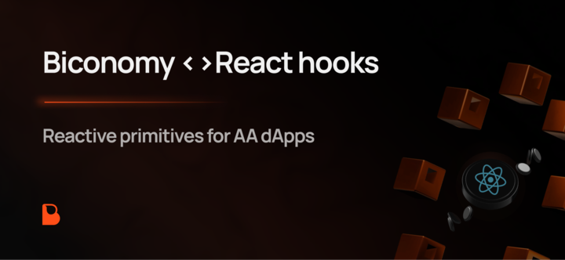

[](https://biconomy.io) [](./LICENSE) 

# useAA



### React Hooks for Account Abstraction on Ethereum

## Installation

```bash
bun add react react-dom viem wagmi @tanstack/react-query @biconomy/account @biconomy/use-aa
```

## Documentation
[API Docs](https://bcnmy.github.io/useAA)

## License

This project is licensed under the MIT License. See the [LICENSE](./LICENSE) file for details

## Example

- [Github](https://github.com/bcnmy/sdk-demo/tree/dev)
- [App](https://sdk-dev.biconomy.io)

## Connect with Biconomy 🍊

[](https://biconomy.io) [](https://t.me/biconomy) [](https://twitter.com/biconomy) [](https://www.linkedin.com/company/biconomy) [](https://discord.gg/biconomy) [](https://www.youtube.com/channel/UC0CtA-Dw9yg-ENgav_VYjRw) [](https://github.com/bcnmy/)